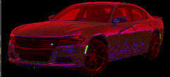

# Color Conversion
## AIM
To perform the color conversion between RGB, BGR, HSV, and YCbCr color models.
## Software Required:
Anaconda - Python 3.7
## Algorithm:
### Step1:
Import CV2 library.
### Step2:
Use cv2.cvtcolor() to convert colot in required image.
### Step3:
Use .imshow() to display and .imwrite() to save.
### Step4:
Use split() to disperse color into separate channels.
### Step5:
Use merge() to combine those separate channels into color.
## Program:
```python
# Developed By:Sai Darshan G
# Register Number:212221240047
# i) Convert BGR and RGB to HSV and GRAY
import cv2
BGR_image=cv2.imread('01.jpg')
cv2.imshow('BGR_Image',BGR_image)
hsv_image=cv2.cvtColor(BGR_image,cv2.COLOR_BGR2HSV)
cv2.imshow('BGR2HSV',hsv_image)
cv2.imwrite('hsv.jpg',hsv_image)
cv2.waitKey(0)
cv2.destroyAllWindows()
# ii)Convert HSV to RGB and BGR
import cv2
HSV_image=cv2.imread('1.png')
cv2.imshow('HSV_Image',HSV_image)
#HSV2BGR
bgr_image=cv2.cvtColor(HSV_image,cv2.COLOR_HSV2BGR)
cv2.imshow('HSV2BGR',bgr_image)
cv2.waitKey(0)
cv2.destroyAllWindows()
# iii)Convert RGB and BGR to YCrCb
import cv2
BGR_image=cv2.imread('1.png')
cv2.imshow('BGR_Image',BGR_image)
#BGR2YCrCb
YCrCb_image=cv2.cvtColor(BGR_image,cv2.COLOR_BGR2YCrCb)
cv2.imshow('BGR2YCrCb',YCrCb_image)
cv2.waitKey(0)
cv2.destroyAllWindows()
# iv)Split and Merge RGB Image
import cv2
BGR_image=cv2.imread('1.png')
blue=BGR_image[:,:,0]
green=BGR_image[:,:,1]
red=BGR_image[:,:,2]
cv2.imshow('BGR_Blue',blue)
cv2.imshow('BGR_Green',green)
cv2.imshow('BGR_Red',red)
merge_bgr=cv2.merge((blue,green,red))
cv2.imshow('merge_bgr',merge_bgr)
cv2.waitKey(0)
cv2.destroyAllWindows()
# v) Split and merge HSV Image
import cv2
house_color_image=cv2.imread('hsv.jpg')
h, s, v = cv2.split(hsv_image)
cv2.imshow('h',h)
cv2.imshow('s',s)
cv2.imshow('v',v)
merge_hsv=cv2.merge((h,s,v))
cv2.imshow('merge_hsv',merge_hsv)
cv2.waitKey(0)
cv2.destroyAllWindows()
```
## Output:

### i) BGR and RGB to HSV and GRAY

### ii) HSV to RGB and BGR

### iii) RGB and BGR to YCrCb

### iv) Split and merge RGB Image

### v) Split and merge HSV Image


## Result:
Thus the color conversion was performed between RGB, HSV and YCbCr color models.
